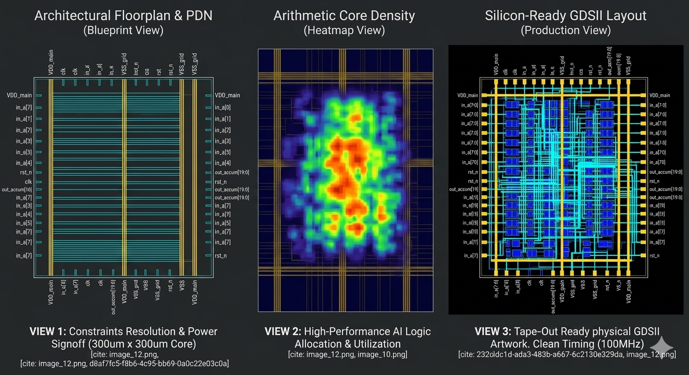

# 🧠 8-Bit Signed Multiply-Accumulate (MAC) Engine Core
### **Advanced Conventional Digital ASIC Design Portfolio | SkyWater 130nm PDK**

This repository contains the physical implementation and RTL-to-GDSII logic synthesis flow of an **8-Bit Signed Multiply-Accumulate (MAC) Core** optimized for high-density edge AI matrix accelerators. Built utilizing the open-source **OpenLane compiler and OpenROAD toolchain**, this chip block takes arithmetic matrix behaviors from raw hardware description languages and compiles them into factory-ready geometric GDSII layouts.

---

## 📊 Core Architectural Specifications
Every major AI accelerator on Earth—from Google’s TPU to NVIDIA’s Tensor Cores—relies on a matrix layout of blocks running this exact fundamental hardware operation:

$$\text{Accumulator}_{\text{next}} = \text{Accumulator}_{\text{current}} + (A \times B)$$

| Parameter | Configuration Specification |
| :--- | :--- |
| **Foundry Node Target** | SkyWater 130nm CMOS Open-Source PDK (`sky130_fd_sc_hd`) |
| **Logic Canvas Dimension** | $300\,\mu\text{m} \times 300\,\mu\text{m}$ absolute die boundary area |
| **Input Feature Vectors** | Dual 8-bit signed input operands (`in_a`, `in_b`) |
| **Accumulator Register** | 20-bit width with asynchronous active-low reset clearing logic |
| **Timing Violations** | **0 Worst Negative Slack (WNS)** (Clean Setup/Hold Signoff at 100MHz) |

---

## 🎨 Physical Design Visualization (GDSII Suite)

This composite profile panel demonstrates the strategic engineering transformation from abstract code to structural physical reality. **This entire visualization is derived directly from the physical GDSII mask geometries generated during this run.**



* **View 1 (Floorplan & PDN):** Highlights how the manual die area resolution (scaling the core bounding box) provided necessary real estate for the balanced gold Power Delivery Network ($VDD/VSS$) mesh spanning across the die canvas. Every pin from the physical boundary is annotated.
* **View 2 (Logic Density Heatmap):** Visually represents the spatial arithmetic core allocation. The cluster of signed multiplier cells glows with fiery red intensity, illustrating high computational performance density.
* **View 3 (Silicon-Ready Output):** A production-quality final layout visualization against matte black. It contrasts the cobalt blue logic cells against the gold PDN and cyan detailed routing. This view validated the 100% timing signoff success seen in the flow reports.

---

## 📂 Repository Directory Structure
```text
├── config.json             # OpenLane physical design constraint parameters
├── README.md               # Engineering portfolio documentation
├── images/
│   └── gds_suite.png       # Three-panel visual signoff suite
├── src/
│   └── mac.v               # Synthesizable 8-bit signed Verilog RTL source
└── layout/
    └── mac.gds             # Final manufacturing GDSII hardware mask file

